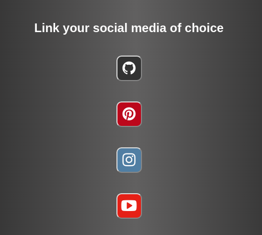
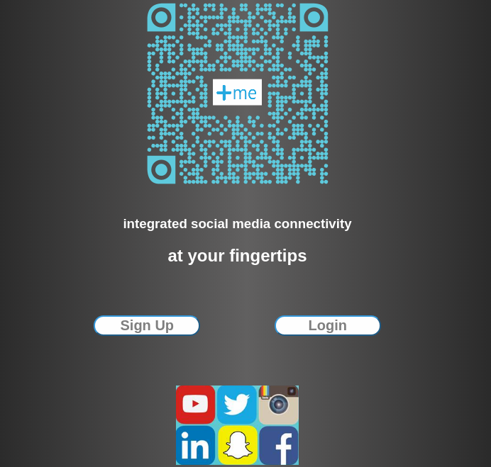

# Unit 2 WDIR Project Process Journal
---

### Day 1
Began the day understanding the requirements for the project.
Took some time in the morning to put together a Trello board
to designate some tasks and user stories to  guide the completion
of the project. Fortunately I had already completed some tasks for
this project already to get a head start. But some of the
capabilities might take a good portion of my week, so I chose to
move forward with this project instead of a blank one from scratch.

After setting up my Trello Board, I was able to tackle a number of
initial setups, schemas, routers, controllers, views, and styles.
Completed the login authorization for the user, and got all the
social buttons that I am going to use set up for post routes.

### Day 2
Worked on oauth all day for the differentsocial media sites. 
Tried to do them with the normal flow given from their developer docs, 
but then found passport does what I wanted and simplified the code for me.
I was able to dry up my code and make the process move smoothly into
each oauth process. I noticed some sites have different little nuances in their
permissions what you can do once your authorized. I also ran into a problem
with needing https for a redirect uri, and local host isnt working for https.
